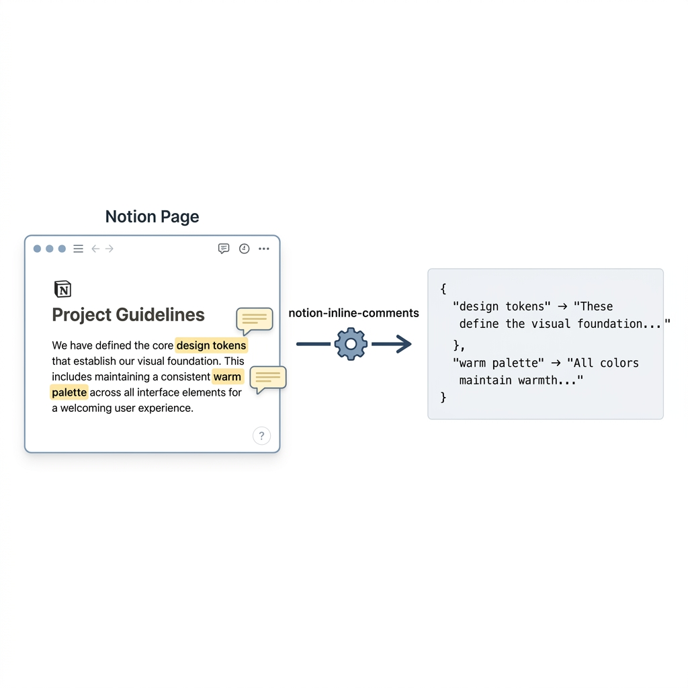
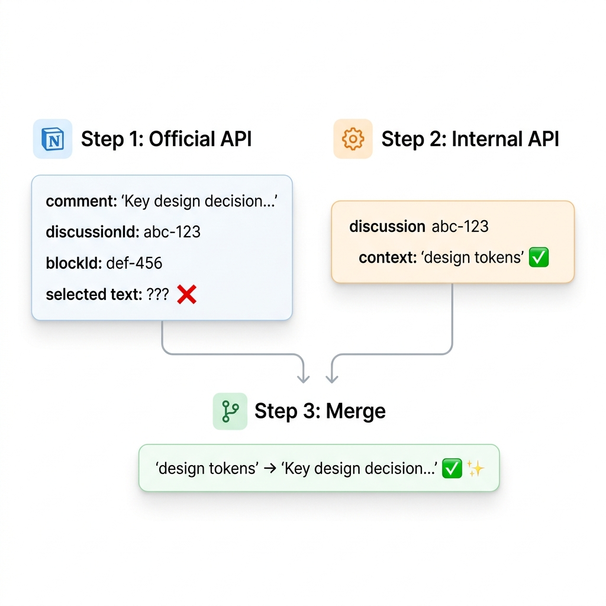
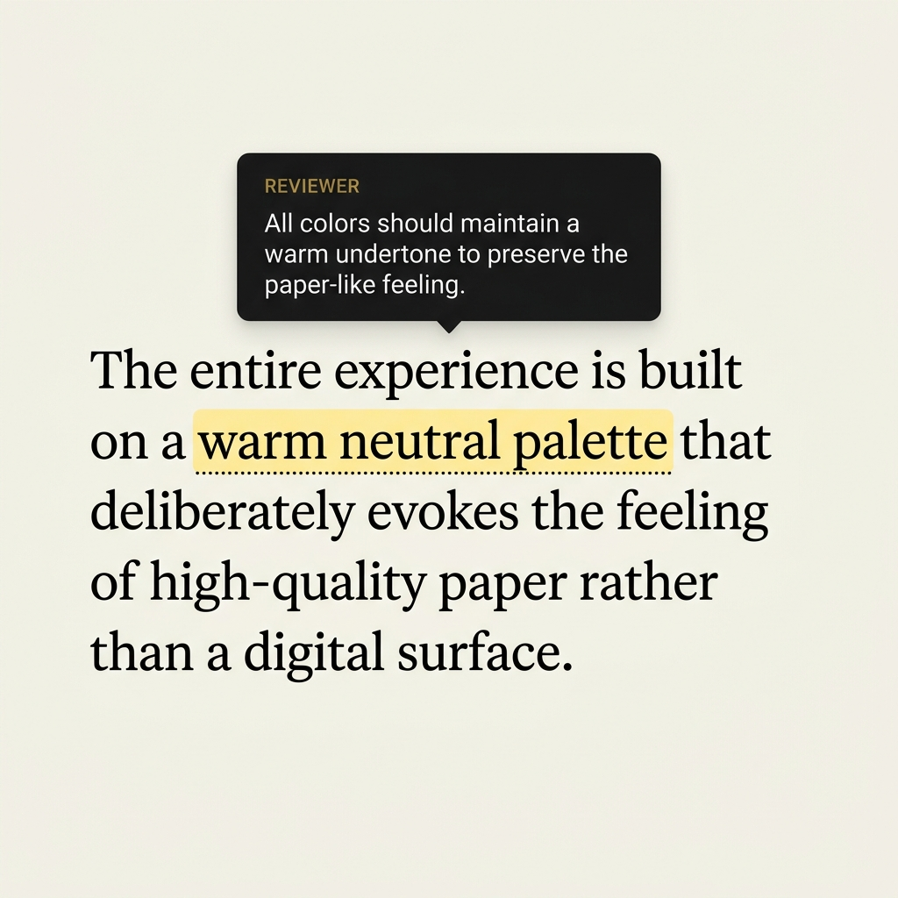

<div align="center">

# 💬 notion-inline-comments

**노션 API의 빠진 퍼즐 조각.**

인라인 댓글을 정확히 어떤 텍스트에 달렸는지와 함께 추출합니다.

[](https://github.com/Thisism26/notion-inline-comments/actions)
[](https://www.npmjs.com/package/notion-inline-comments)
[](./LICENSE)
[](https://nodejs.org)

[🇺🇸 English](./README.md)

<br />



</div>

---

## 문제

노션에서 텍스트를 드래그하고 댓글을 달면, 노션은 어떤 단어를 선택했는지 정확히 알고 있습니다 — **하지만 공식 API는 그 정보를 주지 않습니다.**

```diff
- 공식 API:    댓글 ✅  블록 ✅  선택 텍스트 ❌
+ 이 패키지:   댓글 ✅  블록 ✅  선택 텍스트 ✅
```

---

## 왜 API가 두 개 필요한가?

노션에는 두 개의 API가 있고, **각각 상대방이 모르는 것을 알고 있습니다**:

| | 공식 API (`api.notion.com`) | 내부 API (`notion.so/api/v3`) |
|---|---|---|
| 댓글 내용 | ✅ 전체 텍스트 | ❌ ID만 |
| 작성자 이름 | ✅ 표시 이름 | ❌ 유저 ID만 |
| 선택 텍스트 | ❌ **제공 안 함** | ✅ `discussion.context` |
| 하이라이트 색상 | ❌ | ✅ |
| 해결 상태 | ❌ | ✅ |

**이 패키지는 둘을 합칩니다** — `discussionId`를 키로:

<div align="center">

</div>

---

## 설치

```bash
npm install notion-inline-comments
```

## 빠른 시작

```javascript
import { fetchInlineComments } from 'notion-inline-comments';

const { comments } = await fetchInlineComments({
  pageId: '페이지-ID',
  apiKey: 'secret_xxx',
});

comments.forEach(c => {
  console.log(c.contextText);     // "디자인 토큰"          ← 선택 텍스트
  console.log(c.text);            // "이것은..."            ← 댓글 내용
  console.log(c.blockText);       // "디자인 토큰은..."     ← 전체 블록 텍스트
  console.log(c.highlightColor);  // "yellow_background"
  console.log(c.resolved);        // false
});
```

### 데이터베이스 일괄 스캔

```javascript
import { fetchFromDatabase } from 'notion-inline-comments';

const result = await fetchFromDatabase({
  databaseId: 'DB-ID',
  apiKey: 'secret_xxx',
});

console.log(`${result.totalPages}개 페이지 스캔, ${result.totalMapped}개 댓글 매핑`);
result.pages.forEach(p => {
  console.log(`${p.title}: ${p.result.total}개 댓글`);
});
```

### CLI

```bash
# 단일 페이지
npx notion-inline-comments <page-id> --api-key secret_xxx

# CSV로 내보내기
npx notion-inline-comments <page-id> --api-key secret_xxx --format csv > comments.csv

# 데이터베이스 스캔
npx notion-inline-comments <db-id> --database --api-key secret_xxx
```

### 실제 활용 예시

<div align="center">

</div>

---

## API

### `fetchInlineComments(options)`

| 옵션 | 필수 | 설명 |
|------|:----:|------|
| `pageId` | ✅ | 노션 URL의 페이지 ID |
| `apiKey` | ✅ | Integration 토큰 |
| `tokenV2` | | 브라우저 쿠키 (비공개 페이지용) |
| `includeResolved` | | 해결된 댓글 포함 (기본: `false`) |
| `silent` | | 콘솔 경고 로그 끄기 (기본: `false`) |

### `fetchFromDatabase(options)`

| 옵션 | 필수 | 설명 |
|------|:----:|------|
| `databaseId` | ✅ | 데이터베이스 ID |
| `apiKey` | ✅ | Integration 토큰 |
| `tokenV2` | | 브라우저 쿠키 |
| `limit` | | 최대 스캔 페이지 수 |
| `silent` | | 콘솔 경고 로그 끄기 |

### `InlineComment`

| 필드 | 타입 | 설명 |
|------|------|------|
| `contextText` | `string \| null` | 하이라이트한 텍스트 |
| `text` | `string` | 댓글 내용 |
| `author` | `string` | 작성자 |
| `blockText` | `string \| null` | 전체 블록 텍스트 |
| `highlightColor` | `string \| null` | 예: `"yellow_background"` |
| `resolved` | `boolean` | 해결 여부 |
| `blockId` | `string` | 블록 ID |
| `discussionId` | `string` | 스레드 ID |
| `commentId` | `string` | 댓글 ID |
| `createdAt` | `string` | ISO 8601 |

### 헬퍼 함수

```javascript
import {
  groupByBlock,         // { blockId: [comments] }
  groupByContext,        // Map { "텍스트" => [comments] }
  groupByHighlight,      // { "yellow_background": [...] }
  filterResolved,        // 해결된 것만
  filterUnresolved,      // 미해결만
  toCSV,                 // CSV 문자열
  toMarkdown,            // 마크다운 문자열
} from 'notion-inline-comments';
```

---

## 요구사항

- **Node.js** ≥ 18
- 페이지 접근 권한이 있는 [노션 Integration](https://www.notion.so/my-integrations)

> **참고:** discussion context를 위해 [`notion-client`](https://github.com/NotionX/react-notion-x)(비공식 API)를 사용합니다. 내부 API는 예고 없이 변경될 수 있습니다.

---

<div align="center">

MIT © [Thisism26](https://github.com/Thisism26)

</div>
